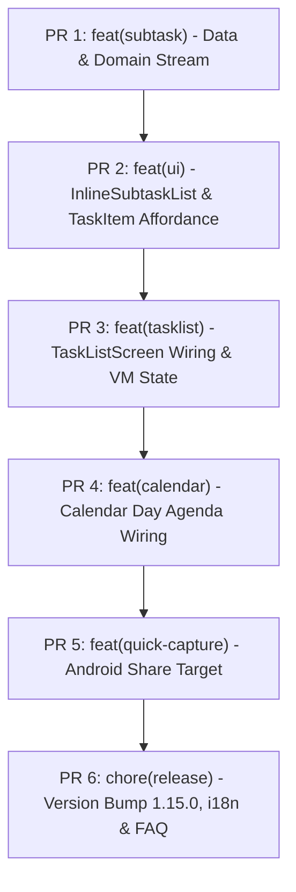

# [TaskTracker] Breakdown — v1.15.0: Inline Expandable Subtasks & Quick Capture

**Parent PRD**: [docs/v1.15.0/PRD.md](file:///Users/tuandoan/s/task-tracker/docs/v1.15.0/PRD.md)  
**Total Estimate**: ~12–16 hours solo  
**Target Release**: v1.15.0  

---

## Split PR Roadmap & Strategy

To maintain high code quality, clean git history, and continuous verification on `main`, `v1.15.0` is split into **6 incremental PRs**:

---

## Detailed PR Breakdown

### PR 1: Data & Domain Layer Subtask Stream (ST-31)
* **Branch**: `feat/subtask-stream-domain`
* **Type**: `feat` / `test`
* **Estimate**: S (2h)
* **Scope & Files**:
  * `app/src/main/java/dev/tuandoan/tasktracker/data/database/SubtaskDao.kt`:
    * Add `@Query("SELECT * FROM subtasks ORDER BY taskId ASC, sortOrder ASC, id ASC") fun observeAllSubtasks(): Flow<List<Subtask>>`
  * `app/src/main/java/dev/tuandoan/tasktracker/domain/repository/ISubtaskRepository.kt` & `SubtaskRepository.kt`:
    * Expose `fun observeSubtasksByTaskId(): Flow<Map<Long, List<Subtask>>>`
  * `app/src/main/java/dev/tuandoan/tasktracker/domain/usecase/SubtaskUseCase.kt`:
    * Expose `fun observeSubtasksByTaskId(): Flow<Map<Long, List<Subtask>>>`
  * `app/src/test/java/dev/tuandoan/tasktracker/domain/usecase/SubtaskUseCaseTest.kt`:
    * Add unit tests verifying grouping by `taskId`, sorting preservation, and reactive emission.
* **Verification**: `./gradlew testDebugUnitTest --tests "dev.tuandoan.tasktracker.domain.usecase.SubtaskUseCaseTest"`

---

### PR 2: InlineSubtaskList Composable & TaskItem Expand Affordance (ST-32)
* **Branch**: `feat/inline-subtask-composable`
* **Type**: `feat` / `ui`
* **Estimate**: M (3h)
* **Scope & Files**:
  * `app/src/main/java/dev/tuandoan/tasktracker/ui/components/InlineSubtaskList.kt` (NEW):
    * Renders list of subtasks for a task with M3 Checkboxes and title strikethrough.
    * Inline compact "Add subtask" row with keyboard `Done` action.
    * TalkBack semantics (`Role.Checkbox`, custom state descriptions).
  * `app/src/main/java/dev/tuandoan/tasktracker/ui/components/TaskItem.kt`:
    * Add `isExpanded: Boolean = false`, `subtasks: List<Subtask> = emptyList()`
    * Add callbacks: `onToggleExpand: () -> Unit`, `onToggleSubtask: (subtaskId: Long, completed: Boolean) -> Unit`, `onAddSubtask: (title: String) -> Unit`
    * Expand/collapse chevron icon button with rotation animation and TalkBack announcement.
    * Animate content expand/collapse using `animateContentSize()`.
  * `app/src/main/res/values/strings.xml`:
    * Add baseline strings: `cd_expand_subtasks`, `cd_collapse_subtasks`, `subtask_add_hint`, `cd_add_subtask`.
* **Verification**: `./gradlew spotlessApply && ./gradlew assembleDebug`

---

### PR 3: TaskListScreen Wiring & ViewModel State Management (ST-33)
* **Branch**: `feat/tasklist-inline-subtasks`
* **Type**: `feat` / `test`
* **Estimate**: M (2–3h)
* **Scope & Files**:
  * `app/src/main/java/dev/tuandoan/tasktracker/ui/viewmodel/TaskViewModel.kt`:
    * Add `subtasksMap: StateFlow<Map<Long, List<Subtask>>> = subtaskUseCase.observeSubtasksByTaskId()`
    * Add `expandedTaskIds: StateFlow<Set<Long>>` with `toggleTaskExpanded(taskId: Long)`
    * Add `toggleSubtaskComplete(subtaskId: Long, completed: Boolean)` and `addSubtask(taskId: Long, title: String)`
  * `app/src/main/java/dev/tuandoan/tasktracker/ui/components/TaskListContent.kt` & `TaskListScreen.kt`:
    * Pass `expandedTaskIds`, `subtasksMap`, and callbacks to `TaskItem`.
  * `app/src/test/java/dev/tuandoan/tasktracker/ui/viewmodel/TaskViewModelTest.kt`:
    * Test `toggleTaskExpanded` add/remove from set.
    * Test `toggleSubtaskComplete` delegates to `SubtaskUseCase.setCompleted`.
* **Verification**: `./gradlew testDebugUnitTest`

---

### PR 4: Calendar Day Agenda Inline Subtasks Integration (ST-34)
* **Branch**: `feat/calendar-inline-subtasks`
* **Type**: `feat` / `test`
* **Estimate**: S-M (2h)
* **Scope & Files**:
  * `app/src/main/java/dev/tuandoan/tasktracker/ui/viewmodel/CalendarViewModel.kt`:
    * Fold `subtasksMap` into `CalendarUiState`.
    * Add `expandedTaskIds: StateFlow<Set<Long>>` and subtask event handlers.
  * `app/src/main/java/dev/tuandoan/tasktracker/ui/components/DayAgendaContent.kt`:
    * Forward `subtasksMap`, `expandedTaskIds`, and callbacks to `TaskItem` (works identically on modal sheet and tablet split-pane).
  * `app/src/test/java/dev/tuandoan/tasktracker/ui/viewmodel/CalendarViewModelTest.kt`:
    * Verify calendar agenda subtask toggle and expansion events.
* **Verification**: `./gradlew testDebugUnitTest`

---

### PR 5: Android Share Target Quick Capture (CAP-01)
* **Branch**: `feat/share-target-quick-capture`
* **Type**: `feat`
* **Estimate**: S (1–2h)
* **Scope & Files**:
  * `app/src/main/AndroidManifest.xml`:
    * Add `<intent-filter>` for `android.intent.action.SEND` with `mimeType="text/plain"`.
  * `app/src/main/java/dev/tuandoan/tasktracker/MainActivity.kt`:
    * Parse `Intent.ACTION_SEND`, extract URL or text payload, route into `TaskTrackerRoutes.taskEditorCreate` with prefill arguments.
  * `app/src/main/java/dev/tuandoan/tasktracker/ui/viewmodel/TaskEditorViewModel.kt`:
    * Handle prefilled initial title and description from nav arguments / intent extras.
  * `app/src/test/java/dev/tuandoan/tasktracker/ui/viewmodel/TaskEditorViewModelTest.kt`:
    * Test prefill extraction and form initialization.
* **Verification**: `./gradlew testDebugUnitTest && ./gradlew assembleDebug`

---

### PR 6: Version Bump, i18n Translations & FAQ Documentation (REL-15)
* **Branch**: `chore/release-v1.15.0`
* **Type**: `chore` / `i18n` / `docs`
* **Estimate**: M (2–3h)
* **Scope & Files**:
  * `app/build.gradle.kts`:
    * Bump `versionMinor = 15`, `versionPatch = 0` (versionCode semver formula update).
  * `app/src/main/res/values-*/strings.xml`:
    * Translate all new string keys across 7 non-English locales (`de`, `es`, `fr`, `hi`, `in`, `pt`, `vi`).
  * `app/src/main/java/dev/tuandoan/tasktracker/ui/screens/HelpScreen.kt`:
    * Add FAQ questions on inline subtasks and sharing text/links to Task Tracker.
  * `CHANGELOG.md`:
    * Add `[1.15.0] - YYYY-MM-DD` release notes.
* **Verification**: Full pre-commit check: `./gradlew spotlessApply && ./gradlew testDebugUnitTest && ./gradlew assembleDebug`
