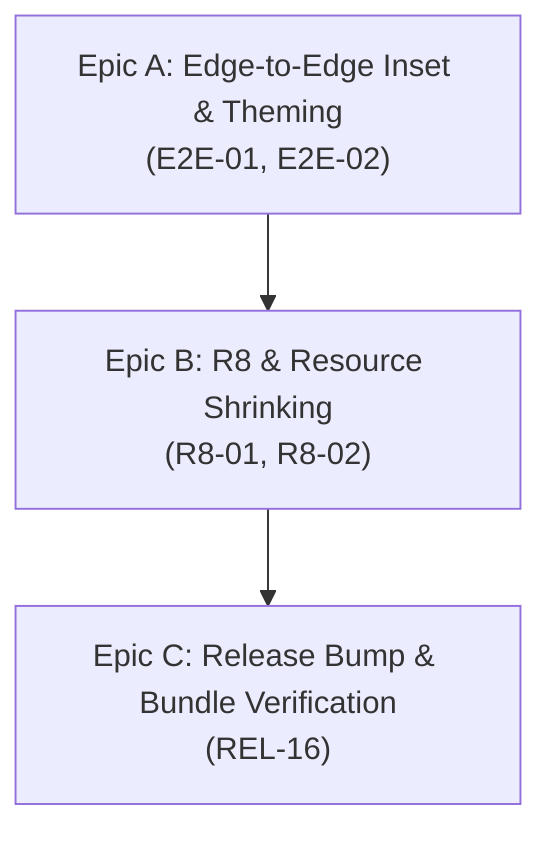

# [TaskTracker] Breakdown — v1.15.1: Play Store Compliance (Edge-to-Edge & R8 Optimization)

**Parent PRD**: [docs/v1.15.1/PRD.md](file:///Users/tuandoan/s/task-tracker/docs/v1.15.1/PRD.md)  
**Total Estimate**: ~3–5 hours solo  
**Target Release**: v1.15.1  

---

## Strategy & Split Roadmap



---

## Detailed Task Breakdown

### Epic A: Edge-to-Edge Display & Theming

```markdown
- [ ] E2E-01: Add navigationBarsPadding to WidgetConfigureScreen
  - Type: fix
  - Estimate: S (0.5h)
  - Files:
    - app/src/main/java/dev/tuandoan/tasktracker/widget/ui/WidgetConfigureScreen.kt
  - Description: Apply Modifier.navigationBarsPadding() to the bottomBar Column holding the Confirm button so it does not collide with the system 3-button or gesture navigation bar on Android 15+.

- [ ] E2E-02: Synchronize System Bar Luminance with App Theme in TaskTrackerTheme
  - Type: feat / fix
  - Estimate: S (1h)
  - Files:
    - app/src/main/java/dev/tuandoan/tasktracker/ui/theme/Theme.kt
  - Description: Use WindowCompat.getInsetsController to dynamically set isAppearanceLightStatusBars and isAppearanceLightNavigationBars based on active darkTheme, ensuring high contrast when users switch ThemeMode in app settings.
```

---

### Epic B: R8 Optimization & Resource Shrinking

```markdown
- [ ] R8-01: Prune Overbroad Compose and Dagger ProGuard Rules
  - Type: refactor / perf
  - Estimate: S (1h)
  - Files:
    - app/proguard-rules.pro
  - Description: Remove redundant blanket -keep rules for Compose runtime/compiler and Dagger/Hilt. Let R8 perform full shrinking, inlining, and obfuscation. Preserve targeted Kotlinx Serialization, Room DB, and Crashlytics stack trace attributes.

- [ ] R8-02: Enable Modern R8 Optimized Resource Shrinking
  - Type: chore / perf
  - Estimate: S (0.5h)
  - Files:
    - gradle.properties
  - Description: Add android.r8.optimizedResourceShrinking=true to gradle.properties to enable unified code and resource shrinking introduced in AGP 8.12+.
```

---

### Epic C: Release Bump & Verification

```markdown
- [ ] REL-16: Version Bump to v1.15.1 and Bundle Validation
  - Type: chore
  - Estimate: S (1h)
  - Files:
    - app/build.gradle.kts
    - CHANGELOG.md
  - Description: Bump versionPatch to 1 (v1.15.1, versionCode 1,789,811,501). Run spotlessApply, testDebugUnitTest, assembleDebug, and bundleRelease. Verify release AAB size decreases from ~25 MB to ~8–12 MB.
```

---

## Verification Commands

```bash
# Code formatting check
./gradlew spotlessCheck

# Run JVM unit tests (263+ tests)
./gradlew testDebugUnitTest

# Assemble debug APK
./gradlew assembleDebug

# Build minified & shrunk release bundle
./gradlew bundleRelease

# Verify AAB size reduction
ls -lh app/build/outputs/bundle/release/app-release.aab
```
