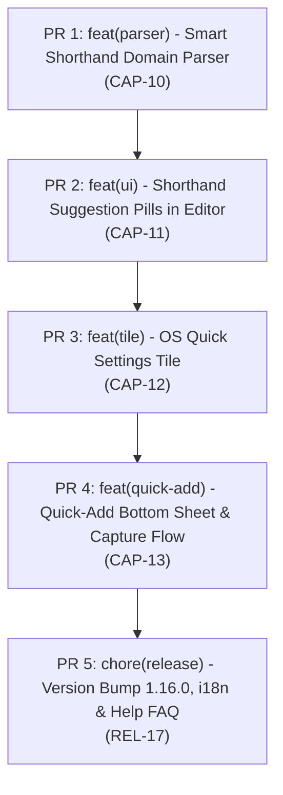

# [TaskTracker] Breakdown — v1.16.0: Lightning Task Capture (Smart Shorthand & Quick Settings)

**Parent PRD**: [docs/v1.16.0/PRD.md](file:///Users/tuandoan/s/task-tracker/docs/v1.16.0/PRD.md)  
**Total Estimate**: ~10–14 hours solo  
**Target Release**: v1.16.0  

---

## Split PR Roadmap & Strategy

To maintain high code quality, clean git history, and continuous verification on `main`, `v1.16.0` is split into **5 incremental PRs**:

---

## Detailed PR Breakdown

### PR 1: Smart Shorthand Domain Parser (CAP-10)
* **Branch**: `feat/shorthand-domain-parser`
* **Type**: `feat` / `test`
* **Estimate**: M (3–4h)
* **Scope & Files**:
  * `app/src/main/java/dev/tuandoan/tasktracker/domain/model/ParsedTaskTokens.kt` (NEW):
    * Data class holding `cleanTitle: String`, `dueAt: Long?`, `dueAtHasTime: Boolean`, `priority: Int?`, `tag: String?`.
  * `app/src/main/java/dev/tuandoan/tasktracker/domain/service/TaskShorthandParser.kt` (NEW):
    * Pure Kotlin tokenizer with zero Android deps.
    * Parses relative dates (`today`, `tomorrow`, `mon`..`sun`, `next week`).
    * Parses times (`at 5pm`, `at 14:30`, `9am`, `17:00`).
    * Parses priority (`!high`/`!h`/`!3`, `!med`/`!m`/`!2`, `!low`/`!l`/`!1`).
    * Parses tags (`#[A-Za-z0-9_-]+`).
    * Generates `cleanTitle` stripping matched tokens safely.
  * `app/src/test/java/dev/tuandoan/tasktracker/domain/service/TaskShorthandParserTest.kt` (NEW):
    * 25+ JVM unit tests verifying relative dates, times, priority tokens, tags, token stripping, punctuation cleanup, and edge cases.
* **Verification**: `./gradlew testDebugUnitTest --tests "dev.tuandoan.tasktracker.domain.service.TaskShorthandParserTest"`

---

### PR 2: Shorthand Suggestion Pills in Task Editor (CAP-11)
* **Branch**: `feat/shorthand-editor-suggestions`
* **Type**: `feat` / `ui`
* **Estimate**: M (2–3h)
* **Scope & Files**:
  * `app/src/main/java/dev/tuandoan/tasktracker/domain/usecase/TaskFormUseCase.kt`:
    * Add reactive parsing of `_taskTitle` into `parsedTokens: StateFlow<ParsedTaskTokens>`.
    * Add `applyParsedToken(tokenType)` to transfer extracted date, priority, or tag directly into the form fields and strip token from title.
  * `app/src/main/java/dev/tuandoan/tasktracker/ui/components/ShorthandSuggestionRow.kt` (NEW):
    * Animated row of `AssistChip` / suggestion pills rendering under title field.
    * Date, priority, and tag pills with icon and localized text.
    * TalkBack semantics.
  * `app/src/main/java/dev/tuandoan/tasktracker/ui/screens/TaskEditorScreen.kt`:
    * Wire `ShorthandSuggestionRow` below title field.
  * `app/src/main/res/values/strings.xml`:
    * Add baseline strings: `cd_shorthand_date`, `cd_shorthand_priority`, `cd_shorthand_tag`.
* **Verification**: `./gradlew testDebugUnitTest && ./gradlew assembleDebug`

---

### PR 3: OS Quick Settings Tile (CAP-12)
* **Branch**: `feat/quick-settings-tile`
* **Type**: `feat`
* **Estimate**: S-M (2h)
* **Scope & Files**:
  * `app/src/main/java/dev/tuandoan/tasktracker/work/QuickAddTaskTileService.kt` (NEW):
    * Extends `android.service.quicksettings.TileService`.
    * Handles `onClick()`: unlock screen if needed, launch `MainActivity` with `ACTION_QUICK_ADD`.
  * `app/src/main/AndroidManifest.xml`:
    * Register `QuickAddTaskTileService` with `BIND_QUICK_SETTINGS_TILE`.
  * `app/src/main/res/drawable/ic_task_add.xml` (NEW):
    * Vector icon for Quick Settings tile.
  * `app/src/main/res/values/strings.xml`:
    * Add `quick_add_tile_label`, `quick_add_tile_subtitle`.
* **Verification**: `./gradlew assembleDebug`

---

### PR 4: Quick-Add Bottom Sheet & Capture Flow (CAP-13)
* **Branch**: `feat/quick-add-bottom-sheet`
* **Type**: `feat` / `ui`
* **Estimate**: M (2–3h)
* **Scope & Files**:
  * `app/src/main/java/dev/tuandoan/tasktracker/ui/components/QuickAddBottomSheet.kt` (NEW):
    * Lightweight M3 bottom sheet with auto-focused single line input.
    * Renders live `ShorthandSuggestionRow`.
    * Save button & IME `Done` saves task with parsed tokens immediately via `TaskCrudManager`.
  * `app/src/main/java/dev/tuandoan/tasktracker/MainActivity.kt`:
    * Handle `ACTION_QUICK_ADD` intent by showing `QuickAddBottomSheet` over current screen.
  * `app/src/main/java/dev/tuandoan/tasktracker/ui/viewmodel/TaskViewModel.kt`:
    * Add quick-add event handling and persistence delegation.
  * `app/src/test/java/dev/tuandoan/tasktracker/ui/viewmodel/TaskViewModelTest.kt`:
    * Unit tests for quick-add execution.
* **Verification**: `./gradlew testDebugUnitTest && ./gradlew assembleDebug`

---

### PR 5: Release Bump, i18n & Help FAQ (REL-17)
* **Branch**: `chore/v1.16.0-release-prep`
* **Type**: `chore` / `i18n`
* **Estimate**: S (1–2h)
* **Scope & Files**:
  * `app/src/main/res/values-*/strings.xml`:
    * Localize all new keys to de, es, fr, hi, in, pt, vi.
  * `app/src/main/java/dev/tuandoan/tasktracker/ui/screens/HelpScreen.kt`:
    * Add FAQ entries explaining Shorthand Syntax and Quick Settings Tile.
  * `app/build.gradle.kts`:
    * Bump `versionMinor` to 16, `versionPatch` to 0 (`v1.16.0`, `versionCode 1,789,811,600`).
  * `CHANGELOG.md`:
    * Document all new features under `## [1.16.0]`.
* **Verification**: `./gradlew spotlessCheck && ./gradlew testDebugUnitTest && ./gradlew bundleRelease`
