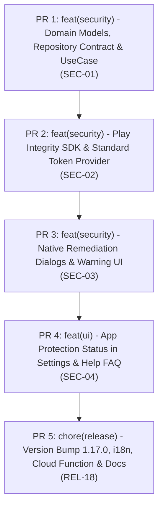

# [TaskTracker] Breakdown — v1.17.0: Play Integrity Integration & Remediation

**Parent PRD**: [docs/v1.17.0/PRD.md](file:///Users/tuandoan/s/task-tracker/docs/v1.17.0/PRD.md)  
**Status**: Implemented & In Review  
**Total Estimate**: ~8–12 hours solo  
**Target Release**: v1.17.0  

---

## Split PR Roadmap & Strategy

To maintain high code quality, clean git history, and continuous verification on `main`, `v1.17.0` is split into **5 incremental PRs**:

---

## Detailed PR Breakdown

### PR 1: Domain Models, Repository Contract & UseCase (SEC-01)
* **Branch**: `feat/play-integrity-domain`
* **Pull Request**: [#178](https://github.com/doananhtuan22111996/task-tracker/pull/178)
* **Type**: `feat` / `test`
* **Estimate**: S-M (2h)
* **Scope & Files**:
  * `docs/v1.17.0/SCOPE.md`, `docs/v1.17.0/PRD.md`, `docs/v1.17.0/BREAKDOWN.md`
  * `app/src/main/java/dev/tuandoan/tasktracker/domain/security/model/IntegrityStatus.kt` (NEW):
    * `AppLicensingStatus`, `DeviceIntegrityStatus`, `IntegrityVerdict`, `IntegrityCheckResult`.
  * `app/src/main/java/dev/tuandoan/tasktracker/domain/security/repository/IntegrityRepository.kt` (NEW):
    * Repository interface (`warmUp`, `verifyIntegrity`, `launchRemediationDialog`).
  * `app/src/main/java/dev/tuandoan/tasktracker/domain/security/usecase/VerifyAppIntegrityUseCase.kt` (NEW):
    * Domain use case coordinating integrity verification, hash generation, and fallback policies.
  * `app/src/test/java/dev/tuandoan/tasktracker/testutil/FakeIntegrityRepository.kt` (NEW):
    * Test fake for JVM unit testing.
  * `app/src/test/java/dev/tuandoan/tasktracker/domain/security/VerifyAppIntegrityUseCaseTest.kt` (NEW):
    * JVM unit tests verifying successful verdict mapping, offline degradation, and error handling.
* **Verification**: `./gradlew testDebugUnitTest --tests "dev.tuandoan.tasktracker.domain.security.*"`

---

### PR 2: Play Integrity SDK & Standard Token Provider (SEC-02)
* **Branch**: `feat/play-integrity-sdk`
* **Pull Request**: [#179](https://github.com/doananhtuan22111996/task-tracker/pull/179)
* **Type**: `feat`
* **Estimate**: M (2–3h)
* **Scope & Files**:
  * `gradle/libs.versions.toml`:
    * Add `playIntegrity = "1.6.0"` and `google-play-integrity` library.
  * `app/build.gradle.kts`:
    * Add `implementation(libs.google.play.integrity)`.
    * Inject `BuildConfig.GOOGLE_CLOUD_PROJECT_NUMBER = 661684282575L`.
  * `app/src/main/java/dev/tuandoan/tasktracker/data/security/PlayIntegrityRepositoryImpl.kt` (NEW):
    * Implements `IntegrityRepository` via `StandardIntegrityManager`.
    * Warmup with `prepareIntegrityToken()`.
    * Token request with SHA-256 request hash.
    * Layered offline fallback (signing cert fingerprint + installer source check).
  * `app/src/main/java/dev/tuandoan/tasktracker/di/SecurityModule.kt` (NEW):
    * Hilt module binding `PlayIntegrityRepositoryImpl` to `IntegrityRepository`.
  * `app/src/main/java/dev/tuandoan/tasktracker/TaskTrackerApplication.kt`:
    * Asynchronously trigger `integrityRepository.warmUp()` on `Dispatchers.IO` at startup.
* **Verification**: `./gradlew testDebugUnitTest && ./gradlew assembleDebug`

---

### PR 3: Native Remediation Dialogs & Warning UI (SEC-03)
* **Branch**: `feat/integrity-remediation`
* **Pull Request**: [#180](https://github.com/doananhtuan22111996/task-tracker/pull/180)
* **Type**: `feat` / `ui`
* **Estimate**: S-M (2h)
* **Scope & Files**:
  * `app/src/main/java/dev/tuandoan/tasktracker/data/security/IntegrityRemediationLauncher.kt` (NEW):
    * Invokes `StandardIntegrityManager.showDialog()` with `GET_LICENSED` (code 1) or access risk codes.
  * `app/src/main/java/dev/tuandoan/tasktracker/ui/components/SideloadWarningDialog.kt` (NEW):
    * Non-destructive Material 3 dialog when unlicensed install is confirmed and remediation is dismissed.
    * "Get Genuine App" button opening Play Store; "Continue" button preserving user tasks.
  * `app/src/main/res/values/strings.xml`:
    * Add base strings for sideload warning title, message, and action buttons.
* **Verification**: `./gradlew testDebugUnitTest && ./gradlew assembleDebug`

---

### PR 4: App Protection Status in Settings & Help FAQ (SEC-04)
* **Branch**: `feat/app-protection-settings-ui`
* **Pull Request**: [#181](https://github.com/doananhtuan22111996/task-tracker/pull/181)
* **Type**: `feat` / `ui`
* **Estimate**: S (1–2h)
* **Scope & Files**:
  * `app/src/main/java/dev/tuandoan/tasktracker/ui/viewmodel/SettingsViewModel.kt`:
    * Expose `appProtectionStatus: StateFlow<IntegrityCheckResult>`.
  * `app/src/main/java/dev/tuandoan/tasktracker/ui/screens/SettingsScreen.kt`:
    * Add "App Protection" ListItem in Security & Privacy section with `VerifiedUser` icon and status chip.
  * `app/src/main/java/dev/tuandoan/tasktracker/ui/screens/HelpScreen.kt`:
    * Add "Play Protect & App Integrity" FAQ item explaining anti-tamper and official updates.
  * `app/src/test/java/dev/tuandoan/tasktracker/ui/viewmodel/SettingsViewModelTest.kt`:
    * Add unit tests for security status flow.
* **Verification**: `./gradlew testDebugUnitTest && ./gradlew assembleDebug`

---

### PR 5: Version Bump 1.17.0, i18n, Cloud Function & Release Docs (REL-18)
* **Branch**: `chore/release-v1.17.0`
* **Pull Request**: [#182](https://github.com/doananhtuan22111996/task-tracker/pull/182)
* **Type**: `chore` / `docs` / `i18n`
* **Estimate**: M (2h)
* **Scope & Files**:
  * `scripts/cloud-functions/verify-integrity/` (NEW):
    * Ready-to-deploy Firebase Cloud Function (`index.js`, `package.json`, `README.md`) verifying tokens with `playintegrity.googleapis.com`.
  * `app/src/main/res/values-*/strings.xml`:
    * Complete translations for all new strings across all 7 non-English locales (`de`, `es`, `fr`, `hi`, `in`, `pt`, `vi`).
  * `app/build.gradle.kts`:
    * Bump `versionMinor` to 17, `versionPatch` to 0 (`v1.17.0`, `versionCode 1,789,811,700`).
  * `CHANGELOG.md`:
    * Add `## [1.17.0] - 2026-10-10` entry.
  * `docs/v1.17.0/`:
    * Local committed copies of `SCOPE.md`, `PRD.md`, and `BREAKDOWN.md`.
* **Verification**: Full pre-commit pipeline:
  `./gradlew spotlessApply && ./gradlew testDebugUnitTest && ./gradlew assembleDebug && ./gradlew bundleRelease`

